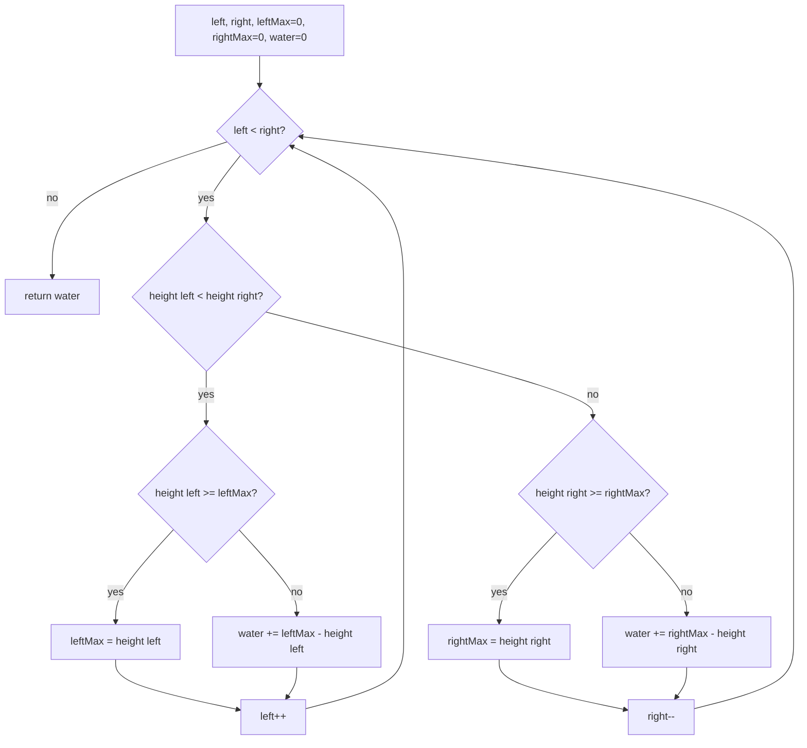

# Opposite ends (trapping rain) — water over each bar, commit the lower side

> **4 of 4 opposite-ends flavors.** New to this? Read the [family overview](../) first — it
> explains the two-marker skeleton and how the flavors differ.
> **This flavor:** the data is **bar heights**; track the tallest wall seen from each side and
> sum the water sitting *on top of every bar*. Canonical problem: #42 Trapping Rain Water.

## TL;DR

**Is it the trapping-rain both-ends trick? Ask these — all "yes" → yes:**
1. **Do I have an elevation / bar-height profile and want the water *trapped on top of it* after rain** — a *total over all bars*, not one rectangle?
2. **Is the water above bar `i` equal to `min(tallest wall to its left, tallest wall to its right) − height[i]`** (and `0` if that's negative)?
3. **Can I decide a bar's water by whichever side wall is *shorter right now***? If the left wall is the shorter of the two extremes, that bar's water is pinned by the left max — settle it and step in. **This one is the decider.**

**Before you code, pin down:** is the answer the *total* trapped units (one number)? are bars non-negative ints? empty / fewer than 3 bars → `0`? do I need per-bar water or just the sum?

**The lines where bugs hide** (details in *How it works*):
move the side with the **smaller height** (that side's max is the binding cap) · update `leftMax`/`rightMax` **before** adding water · water at a bar = `sideMax − height[i]` (never negative — a new max adds `0`) · `while left < right`.

---

## What it is
Rain pools on top of the bars; the water over a single bar rises to the **lower of the two
tallest walls** on either side of it, minus the bar's own height. The brute way computes, for
each bar, the tallest wall to its left and to its right — two extra scans.

The two-pointer trick gets it in one pass. Keep `leftMax` and `rightMax` — the tallest wall seen
so far from each end. Each step, look at the **shorter** of the two current ends:
- If `height[left] < height[right]`, then *some* wall on the right is at least as tall as
  `height[right]`, so the left bar's water is capped by `leftMax` alone — safe to commit. Add
  `leftMax − height[left]`, step `left` in.
- Otherwise do the mirror on the right.

`heights = [0,1,0,2,1,0,1,3,2,1,2,1]` → total trapped **6**.

## What you track
- `left` / `right` — the two markers converging.
- `leftMax` — the tallest bar seen from the left so far; `rightMax` — tallest from the right.
- `water` — running total of trapped units (`+=` each settled bar).

## How it works
Pseudocode. The ⚠️ lines are where every bug hides.

```ts
let left = 0, right = heights.length - 1;
let leftMax = 0, rightMax = 0;
let water = 0;

while (left < right) {                       // ⚠️ < , not <= — the two extreme walls hold no water themselves.
  if (heights[left] < heights[right]) {      // ⚠️ work the SHORTER side; its max is the binding cap.
    if (heights[left] >= leftMax) {
      leftMax = heights[left];               // ⚠️ a new tallest-left wall: it traps 0, just raise the cap.
    } else {
      water += leftMax - heights[left];      // ⚠️ otherwise water = cap − bar (guaranteed ≥ 0 here).
    }
    left++;
  } else {
    if (heights[right] >= rightMax) {
      rightMax = heights[right];
    } else {
      water += rightMax - heights[right];
    }
    right--;
  }
}

return water;
```

Why committing the shorter side is safe: if `height[left] < height[right]`, there is a wall on
the right (`height[right]`) taller than `height[left]`, so `rightMax ≥ height[left]`. The water
over the left bar is `min(leftMax, rightMax) − height[left]` — and since `rightMax` isn't the
limiting one, it's just `leftMax − height[left]`. You never need the *exact* right max to settle
a left bar; you only need to know the right side has something tall enough, which the comparison
guarantees.

Lock these in: **advance the shorter side**, **update the max before adding**, **water = `max −
height` (≥ 0)**, **`while left < right`**.

## Picture


## Where you'll meet it (practice + recognition)

**On LeetCode (and similar platforms):**
- **#42 Trapping Rain Water** — the canonical; two pointers + `leftMax`/`rightMax`, commit the shorter side. (This note's code.)
- **#407 Trapping Rain Water II** — the 2-D version; the same "lowest wall bounds the water" idea but you need a min-heap over the border, not two pointers.
- **#11 Container With Most Water** — same input shape, *opposite* question (one rectangle between two chosen walls) → [`max-area`](../max-area/).

**Real life / other platforms:**
- Estimating standing water on a terrain elevation profile after rain.
- "How much buffer fills between peaks" — any capacity-between-barriers tally.

**Looks like it but ISN'T:** *Container With Most Water* — identical bar-height input, but it
picks the single best **pair** of walls (area = width × shorter wall), while trapping sums water
**over every bar** (driven by the running max on each side). Tell them apart by "between two
lines" (max-area) vs "on top of all the bars" (trapping). Sibling: [`max-area`](../max-area/).

---

Solution code (fully commented): [`solution.ts`](./solution.ts).
