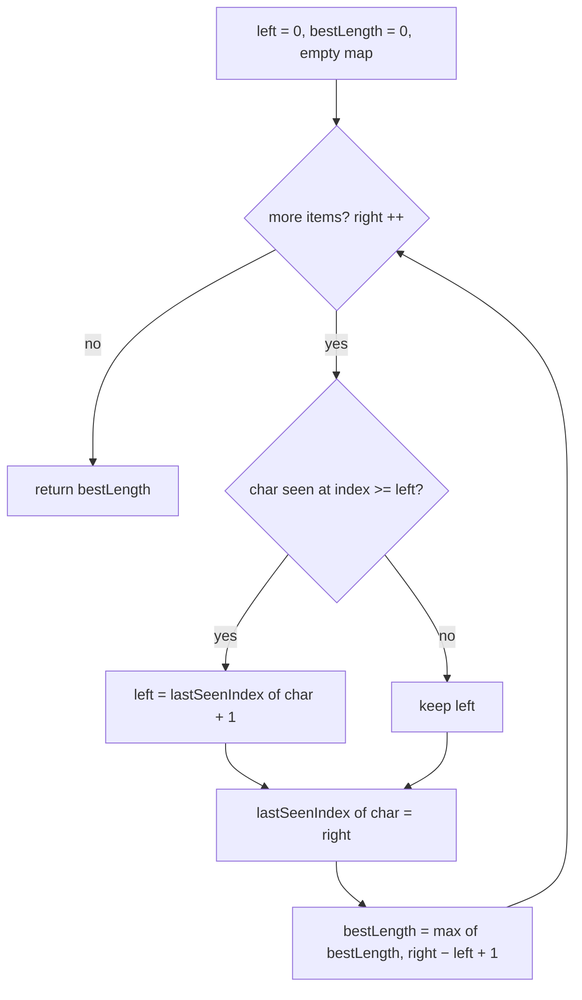

# Sliding window (variable, distinct) — grow until it breaks, then shrink

> **1 of 3 sliding-window flavors.** New to this? Read the [family overview](../) first —
> it explains what a "window" is, the goal, and how the three flavors differ.
> **This flavor:** the window's width is **not fixed** — grow the right edge, and when a
> rule breaks (a repeat appears) pull the left edge in until it's valid; you want the
> **longest** valid run. Canonical problem: #3 Longest Substring Without Repeating Chars.

## TL;DR

**Is it a grow-then-shrink window? Ask these — all "yes" → yes:**
1. **Am I after the *longest* run that obeys a rule** — here "no repeats" (or "at most K distinct", "no more than N of any one thing")?
2. **Does the window's size depend on the data**, not a fixed `k`? It stretches when the rule holds and contracts when it's broken.
3. **When a *new* item breaks the rule, can I fix it by pulling the *left* edge in** (never touching the right)? If sliding the left forward always restores the rule → yes. **This one is the decider.**

**Before you code, pin down:** what exactly makes the window invalid (a repeat? > K distinct?)? do I want the length, or the actual substring? are characters/items case-sensitive? does an empty input return `0`?

**The lines where bugs hide** (details in *How it works*):
jump left with `left = max(left, lastSeen + 1)` — **the `max()` is the "abba" trap** · update `lastSeen` *after* the jump · measure the window only after it's valid again.

---

## What it is
A window whose width **isn't fixed**. You push the right edge out one item at a time
(greedily growing), and the moment the window breaks its rule — here, *every item must
be distinct* — you pull the **left** edge in until the rule holds again. Because the
right only ever moves forward and the left only ever moves forward, every item enters
once and leaves once: still one pass, O(n), even though there's a shrink inside.

`s = "abcabcbb"`, longest run with no repeat:
- grow `a`, `ab`, `abc` → all distinct, best `3`
- next char `a` is already in `abc` → pull left past the old `a` → window becomes `bca`
- keep going `bca` → `cab` → `abc`… the best never beats `3`. Answer `3`.

The trap is `"abba"`: when the second `a` arrives, the old `a` is at index 0 but the
window has *already* moved past it — left is at index 2. Snapping left back to "old `a`
+ 1 = 1" would drag it **backwards** and re-admit the `b`s. `max()` stops that.

## What you track
- `left` — the left edge; only ever moves right.
- `right` — the loop index; the item currently entering on the right.
- `lastSeen` — a hashmap **item → the last index it appeared at**, so a clash tells you exactly where to jump `left`.
- `best` — the longest valid window length seen so far.

## How it works
Pseudocode (Longest Substring Without Repeating Characters). The three ⚠️ lines are
where every bug hides — read those slowly; the rest is filler.

```ts
const lastSeenIndex = new Map<string, number>(); // char -> last index we saw it
let left = 0;                                     // left edge of the window
let bestLength = 0;                               // longest run with no repeat

for (let right = 0; right < s.length; right++) {  // right edge: the char entering now
  const char = s[right];                          // the char arriving on the right

  if (lastSeenIndex.has(char) && lastSeenIndex.get(char)! >= left) {
    left = lastSeenIndex.get(char)! + 1;  // ⚠️ jump left PAST the old copy. The `>= left`
                                          //    check (or a max()) is the "abba" trap: without
                                          //    it a stale index drags left BACKWARD and you
                                          //    over-count.
  }

  lastSeenIndex.set(char, right);         // ⚠️ record AFTER the jump, so the map holds the
                                          //    newest position of this char.

  bestLength = Math.max(bestLength, right - left + 1); // ⚠️ measure only now — the window is valid again.
                                                       //    +1 because both ends are inclusive.
}

return bestLength;
```

Lock these three in and it's O(n) and correct: **`>= left` / `max()` guard on the jump**, **update `lastSeen` after jumping**, **score `right − left + 1` after the window is fixed**.

## Picture


## Where you'll meet it (practice + recognition)

**On LeetCode (and similar platforms):**
- **#3 Longest Substring Without Repeating Characters** — longest distinct run (this note's code).
- **#159 / #340 Longest Substring with At Most K Distinct** — same shape; the rule is "≤ K distinct" instead of "all distinct", so you shrink while the distinct-count exceeds K.
- **#424 Longest Repeating Character Replacement** — grow while "window length − count of the most frequent char ≤ k"; shrink when it isn't.
- **#1004 Max Consecutive Ones III** — longest run with at most `k` zeros flipped — grow, shrink when zeros exceed `k`.

**Real life / other platforms:**
- Longest stretch of a user session with no repeated event/page before they circle back (see `longestUniqueEventRun` in [`solution.ts`](./solution.ts)).
- Longest span of a log with no duplicate request id; deepest unique-path crawl before a cycle.
- De-duplicating a stream within a moving horizon.

**Looks like it but ISN'T:** if you're chasing the **shortest** window that *reaches* a target (sum ≥ X), it's the mirror trick — grow until good, then shrink to minimize: [`shrink-to-target`](../shrink-to-target/). If the width is **fixed** up front, it's [`fixed-size`](../fixed-size/). And two markers walking inward from both ends of a **sorted** array is [`opposite-ends`](../../opposite-ends/), not a window.

---

Solution code (#3 + the unique-event-run twin, fully commented): [`solution.ts`](./solution.ts).
