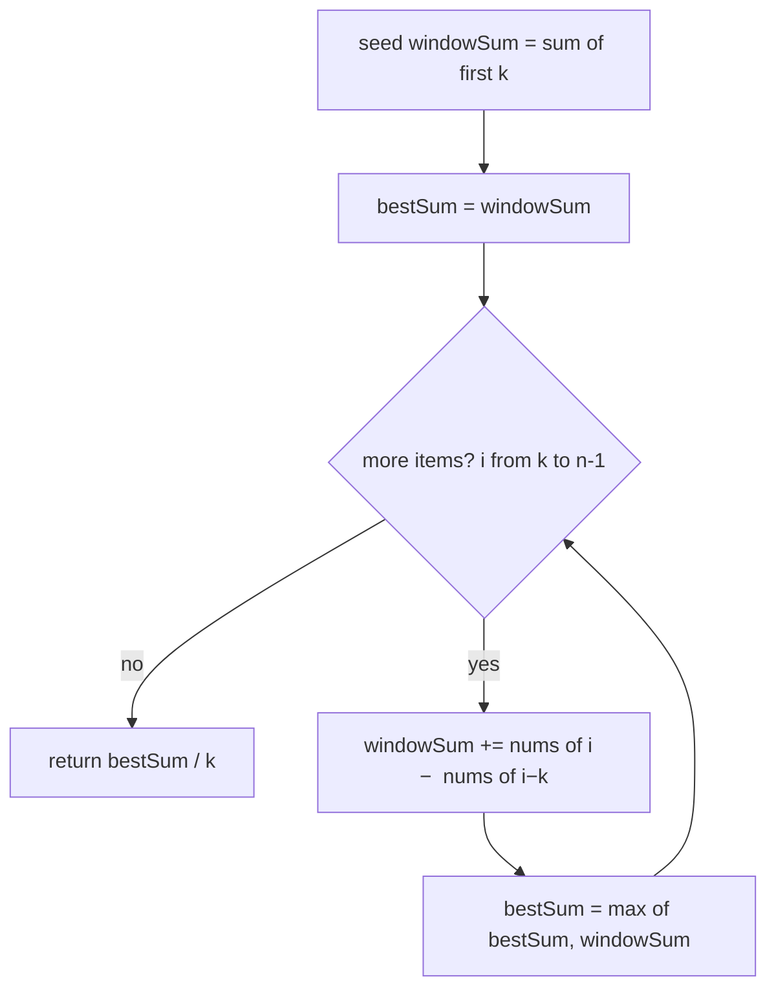

# Sliding window (fixed size) — slide a k-wide window, don't rebuild it

## TL;DR

**Is it a fixed-size window? Ask these — all "yes" → yes:**
1. **Am I scanning every block of the *same* width `k` in a row?** The size is given up front and never changes. (Size depends on the data → not this; that's a *variable* window.)
2. **Do I want one number per block** — its sum / average / max / min — **and then the best block overall?**
3. **Can I get the next block's answer from the current one in one step**, by adding the item that just entered on the right and subtracting the one that just left on the left? If yes → slide instead of re-summing. **This one is the decider.**

**Before you code, pin down:** is `k` truly fixed and known before the scan? sum, average, or max/min per block? what if `k > n` or the array is empty? could the running sum overflow (huge values × big `k`)?

**The lines where bugs hide** (details in *How it works*):
seed the first window *before* the loop · slide with `sum += nums[i] − nums[i−k]` (never re-sum the block) · only read an answer once the window is full (`i ≥ k−1`).

---

## What it is
Run a window of **fixed width `k`** across the list and keep one running answer for
what's inside it. The trick is to **slide, not rebuild**: when the window moves one
step right, a single new item comes in on the right and a single old item drops off
the left — so you add one number and subtract one number instead of re-adding all `k`.
That turns each step into O(1), and the whole pass into one loop (O(n)) instead of a
loop-inside-a-loop (O(n·k)).

`nums = [1, 12, -5, -6, 50, 3]`, `k = 4`:
- first window `[1, 12, -5, -6]` → sum `2`
- slide → drop `1`, add `50` → `[12, -5, -6, 50]` → sum `2 − 1 + 50 = 51` → best so far
- slide → drop `12`, add `3` → `[-5, -6, 50, 3]` → sum `51 − 12 + 3 = 42`
- best sum `51`, so best average `51 / 4 = 12.75`.

## What you track
- `windowSum` — the running total of the `k` items currently inside the window.
- `bestSum` — the best total seen across all windows (divide by `k` at the very end if you need an average).
- `k` — the fixed width; it never changes, so there's no left/right gap to manage.

## How it works
Pseudocode (Max Average Subarray I). The three ⚠️ lines are where every bug hides —
read those slowly; the rest is filler.

```
windowSum = sum of nums[0 .. k-1]     // ⚠️ SEED the first window before looping. Skip
                                      //    this and your first comparison is garbage.

bestSum = windowSum

for i from k to n-1:                  // i = the item ENTERING on the right
    windowSum += nums[i] - nums[i-k]  // ⚠️ add entrant, drop leaver — in ONE line. If you
                                      //    re-sum the k items here it's O(n*k), the slow trap.
                                      //    nums[i-k] is the item leaving on the LEFT.

    bestSum = max(bestSum, windowSum) // ⚠️ only valid because the window is always full now
                                      //    (we started i at k). Reading a half-built window
                                      //    early counts too few items.

return bestSum / k                    // divide once; dividing each step adds float noise
```

Lock these three in and it stays O(n) and correct: **seed before the loop**, **slide with `+nums[i] − nums[i−k]`**, **score only the full window**.

## Picture


## Where you'll meet it (practice + recognition)

**On LeetCode (and similar platforms):**
- **#643 Max Average Subarray I** — best average of any `k` in a row (this note's code).
- **#1456 Max Number of Vowels in a Substring of Length k** — same slide, "is a vowel?" as the per-item value.
- **#346 Moving Average from Data Stream** — emit the average of the last `k` as numbers arrive; the window slides forward one tick at a time.
- **#239 Sliding Window Maximum** — *looks* identical but the *max* of a window can't be slid by add/subtract; it needs a monotonic deque. Same window, harder bookkeeping.

**Real life / other platforms:**
- Rolling metrics — peak bytes / requests over any fixed N-line window of a log (see `peakBytesInWindow` in [`solution.ts`](./solution.ts)).
- Smoothing a noisy sensor or price feed with a moving average of the last `k` samples.
- Fixed time-bucket rate checks ("most calls in any 60-second window").

**Looks like it but ISN'T:** if the window's size is **not** fixed — it grows and shrinks based on a rule (distinct items, sum ≥ target) — it's a *variable* window: [`variable-distinct`](../variable-distinct/) or [`shrink-to-target`](../shrink-to-target/). And a fixed-window **running total** with no "max" is just a [`prefix-sum`](../../../prefix-sum/highest-altitude/) cousin.

---

Solution code (#643 + the rolling-bytes twin, fully commented): [`solution.ts`](./solution.ts).
