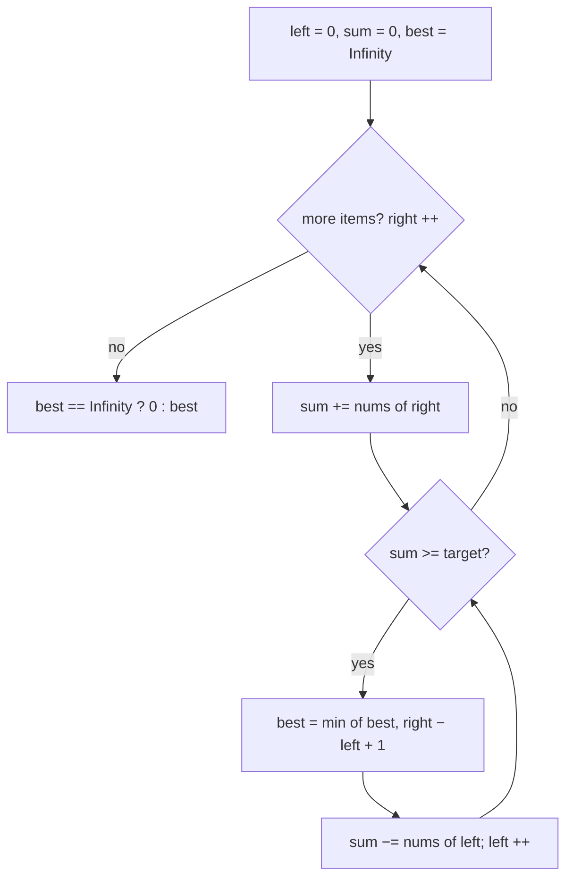

# Sliding window (shrink to target) — grow until good enough, then tighten

## TL;DR

**Is it a grow-then-minimize window? Ask these — all "yes" → yes:**
1. **Am I after the *shortest* contiguous run that *reaches* a target** — sum ≥ X, or "covers" some requirement?
2. **Are the numbers non-negative**, so that adding an item can only *raise* the running total and removing one can only *lower* it?
3. **Once the window meets the target, does shrinking from the left keep it valid until it suddenly doesn't?** If "passing the target" is monotonic like that → yes. **This one is the decider.**

**Before you code, pin down:** shortest length, or the actual subarray? is the comparison `≥` or strictly `>`? what to return when *nothing* qualifies (here `0`)? **are negatives possible?** (they break this trick — see below).

**The lines where bugs hide** (details in *How it works*):
shrink with a **`while`**, not an `if` · record the min length **inside** the shrink loop (before dropping the left item) · return `0` (not `Infinity`) when nothing qualifies.

---

## What it is
The mirror image of the distinct-window trick. There the window grew until it went
**bad** and you shrank to fix it. Here the window grows until it becomes **good
enough** — its sum reaches the target — and then you shrink from the left **as far as
you can while it still clears the target**, hunting for the *smallest* window that
qualifies. Right moves forward, left moves forward, each item in once and out once: O(n).

`nums = [2, 3, 1, 2, 4, 3]`, `target = 7`:
- grow `2,3,1,2` → sum `8 ≥ 7` → window length `4`; shrink: drop `2` → `3,1,2`=6 < 7, stop. best `4`… but keep going
- grow to `3,1,2,4` → `10 ≥ 7` → shrink: drop `3`→`1,2,4`=7 ≥7 (len 3), drop `1`→`2,4`=6<7 stop. best `3`
- grow `2,4,3` → `9` → shrink: drop `2`→`4,3`=7 (len 2!), drop `4`→`3`=3<7 stop. best `2`. Answer `2`.

Why non-negative matters: the whole "once we pass the target, shrinking only lowers
the sum" logic assumes removing an item can't *raise* the total. A negative number
breaks that — passing the target is no longer monotonic — and you'd need prefix-sums
+ a deque instead.

## What you track
- `left` — the left edge; only ever moves right.
- `right` — the loop index; the item entering on the right.
- `sum` — the running total of the current window.
- `best` — the smallest qualifying length so far (start it at ∞ as "none yet").

## How it works
Pseudocode (Minimum Size Subarray Sum). The three ⚠️ lines are where every bug hides —
read those slowly; the rest is filler.

```
left = 0
sum  = 0
best = Infinity                 // sentinel: "no qualifying window yet"

for right from 0 to n-1:
    sum += nums[right]          // grow on the right

    while sum >= target:        // ⚠️ WHILE, not if. One `if` peels a single item and
                                //    misses tighter windows; keep shrinking while it
                                //    still clears the target.
        best = min(best, right - left + 1)  // ⚠️ record INSIDE the loop, BEFORE removing
                                            //    the left item — that window is the
                                            //    current smallest valid one.
        sum -= nums[left]
        left += 1

return best == Infinity ? 0 : best   // ⚠️ turn the sentinel into 0. Returning Infinity
                                     //    (or a wrong 0 mid-run) breaks the "none" contract.
```

Lock these three in and it's O(n) and correct: **shrink with `while`**, **record the min before dropping the left**, **map the ∞ sentinel to `0`**.

## Picture


## Where you'll meet it (practice + recognition)

**On LeetCode (and similar platforms):**
- **#209 Minimum Size Subarray Sum** — shortest run with sum ≥ target (this note's code).
- **#76 Minimum Window Substring** — shortest window of `s` containing all of `t`; same grow-then-shrink, but "good enough" means "covers every needed character" tracked with a count map (the hard cousin).
- **#1208 Get Equal Substrings Within Budget** — longest window whose change-cost stays within a budget — the *longest* sibling of this same shrink idea.

**Real life / other platforms:**
- Fewest consecutive transactions to refund that clear a threshold (see `fewestTxToClear` in [`solution.ts`](./solution.ts)).
- Smallest contiguous time-slice of request counts that hits a quota / SLA breach.
- Shortest span of a stream that accumulates "enough" of something (bytes, points, votes).

**Looks like it but ISN'T:** if you want the **longest** run that obeys a rule (rather than the shortest that reaches a target), it's [`variable-distinct`](../variable-distinct/) (grow-til-bad). If the width is **fixed**, it's [`fixed-size`](../fixed-size/). If negatives are in play, sliding breaks — reach for prefix-sums (a [`prefix-sum`](../../../prefix-sum/highest-altitude/) relative) instead.

---

Solution code (#209 + the fewest-transactions twin, fully commented): [`solution.ts`](./solution.ts).
